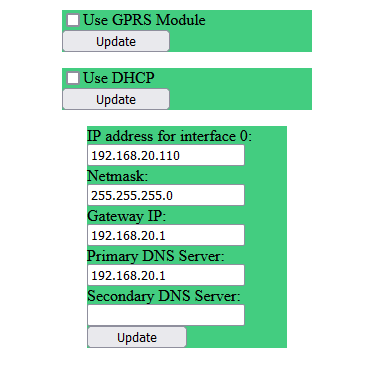
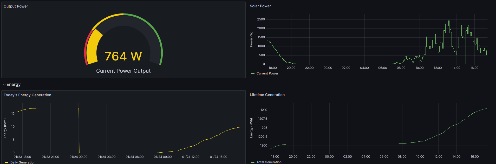

# APS ECU-3 Data Reader

Quick n dirty script for pulling solar panel data from the APS-ECU-3 unit.

## Description 

I have an APsystems ECU-3 Energy Communication Unit, to read the amount of power my solar panels are generating. This system however does not seem to have an API, or any obvious
method of integration into a smart home system, or custom database; it does however, host a webpage. This script allows a user to hit the webpage, scrape relevant data, then write it to a csv, or send it out over mqtt to, for example, homeassistant. 

The code is extroadinarily simple, if you need more out of it, take some inspiration and write your own. This is really just for people unfamiliar with programming. 

## Setup

Firstly you need to be able to hit the ECU webpage, I have the unit plugged in via RJ45/Ethernet. After a while having been connected, an IP address will pop-up on the screen with the word +WEB meaning its hosting the website properly. The first thing to do is set it to have a static IP by navigating to Administration -> Network Connectivity.

You then untick "use dhcp" an enter your details into the boxes below, an example is shown below:



## Script

Script can be configured from the data-puller.conf file. It should be self explanitory. An example .conf is provided. 

```
ip=ecu3ip
csv_filename=<name>.csv
sleep_time=300 
mqtt=True
mqtt_host=127.0.0.1
mqtt_port=1883
mqtt_topic=custom/power/solar
```
- time to sleep is for time for between checking the page (my ecu only updates every 5min)
- if you dont want mqtt set it to False
Then run the script to see if everything is working, it should be writing to the csv. The csv wont have column titles, so add those manually

## Service

You'll probably want this script running as a service. The bash script is provided for that purpose. Use it in a systemd service like:

```
[Unit]
Description=aps-ecu-3
After=network.target

[Service]
Type=simple
User=user
WorkingDirectory=<path to folder>
Restart=always
RestartSec=30
ExecStart=<path to folder>/aps-ecu-3-pull-data.sh

[Install]
WantedBy=multi-user.target
```

Then enable and start it. Tutorials for this are plentiful online. 


## example csv:

The output should look something like this:
```
0,Current Power, Daily Generation, Total Generation, Date, Time Since Epoch
0,980.0,5.04,1205.56,24/01/2024 13:28:46,1706065126.742353
0,980.0,5.04,1205.56,24/01/2024 13:29:48,1706065188.0789444
0,980.0,5.04,1205.56,24/01/2024 13:33:29,1706065409.4306822
```
This can be fed into grafana for example to make a nice time series.


## example mqtt:

Listening to the topic with paho wil get you something like this:

```
 Received message b'{"total_power": 764.0, "day_generation": 9.94, "lifetime_generation": 1210.46, "datetime": "24/01/2024 17:18:23", "time_since_epoch": 1706078903.849643}' on topic 'custom/power/solar' with QoS 0
```

## homeassistant 

A basic home assistant mqtt integration for this would look like this:
(place into configuration.yaml)
```
# custom mqtt sensors
mqtt:
  sensor:
    - name: "power"
      unique_id: "solar_panel_power"
      state_topic: "custom/power/solar"
      suggested_display_precision: 1
      unit_of_measurement: "W"
      value_template: "{{ value_json.total_power }}"
      device:
        identifiers: aps-ecu-3
        manufacturer: APsystems
        name: Solar Panel Meter
        model: APS-ECU-3
    - name: "day generation"
      unique_id: "solar_panel_day_generation"
      state_topic: "custom/power/solar"
      unit_of_measurement: "kWh"
      value_template: "{{ value_json.day_generation }}"
      device:
        identifiers: aps-ecu-3
        manufacturer: APsystems
        name: Solar Panel Meter
        model: APS-ECU-3
    - name: "lifetime generation"
      unique_id: "solar_panel_lifetime_generation"
      state_topic: "custom/power/solar"
      unit_of_measurement: "kWh"
      value_template: "{{ value_json.lifetime_generation }}"
      device:
        identifiers: aps-ecu-3
        manufacturer: APsystems
        name: Solar Panel Meter
        model: APS-ECU-3
```
